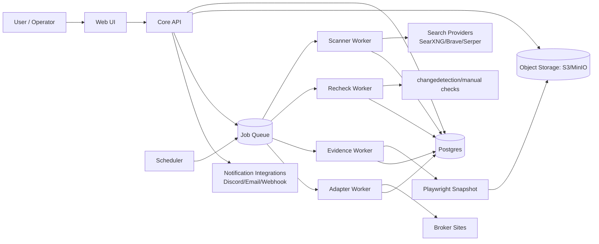

# Architecture (v1)

## System Diagram

## Components

- `core-api`:
  - AuthN/AuthZ
  - Profiles + identifiers CRUD
  - Findings + tasks lifecycle
  - Adapter execution orchestration
  - Dashboard endpoints
- `workers`:
  - scanner: query generation + result ingest
  - adapter: per-broker workflow execution
  - evidence: screenshot/archive capture
  - recheck: recurrence + reappearance detection
- `postgres`:
  - relational source of truth
- `object storage`:
  - screenshots, snapshots, exports
- `notifications`:
  - workflow success/failure + reminders

## Lifecycle

1. User creates profile + identifiers.
2. Scanner runs search templates and broker checks.
3. Findings created with risk score and evidence pointers.
4. User approves/remediates via adapter task.
5. Adapter records outcome (`submitted`, `needs_manual`, `removed`, etc.).
6. Scheduler rechecks at 30/60/90 days.
7. If finding reappears, status transitions to `reappeared` and alerts fire.

## Deployment Targets

- Local: Docker Compose (single host)
- Team: Kubernetes + managed Postgres/object storage
- Future SaaS: same app split, multi-tenant hardening

